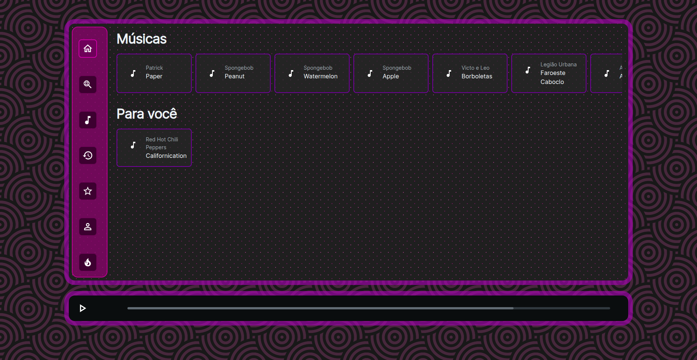

# Batucast

A full-stack music streaming application built with React, TypeScript, and Node.js.

> Software and Systems Engineering (ESS) Project - UFPE 2023.2



## Table of Contents

- [About](#about)
- [Features](#features)
- [Tech Stack](#tech-stack)
- [Getting Started](#getting-started)
  - [Prerequisites](#prerequisites)
  - [Installation](#installation)
  - [Running the Application](#running-the-application)
- [Testing](#testing)
- [Project Structure](#project-structure)
- [API Documentation](#api-documentation)
- [Contributing](#contributing)
- [License](#license)

## About

Batucast is a modern music streaming platform that allows users to discover, play, and organize music. Built as a full-stack TypeScript application, it features a React frontend with Material-UI and an Express.js backend with clean architecture principles.

## Features

### User Management
- User registration and authentication
- Profile management (create, update, delete)
- User login and session management
- Track most listened podcasts, artists, and songs per month

### Playlists
- Create, update, and delete playlists
- Add/remove songs from playlists
- View playlist followers and owners
- Collaborative playlist features

### Content Discovery
- Homepage with personalized recommendations
- "Trending" (Em Alta) page
- Advanced search with filters
- Most played songs tracking

## Tech Stack

### Frontend
- **Framework**: React 18 + TypeScript
- **Build Tool**: Vite
- **UI Library**: Material-UI (MUI Joy + Material)
- **Form Management**: React Hook Form + Zod
- **Routing**: React Router v6
- **HTTP Client**: Axios
- **Testing**: Vitest + React Testing Library + Cypress

### Backend
- **Framework**: Express.js + TypeScript
- **Architecture**: Clean Architecture with Dependency Injection
- **Database**: In-memory singleton (seeded data)
- **Logging**: Pino
- **Testing**: Jest + Cucumber (BDD)

### DevOps
- **Code Quality**: ESLint + Prettier
- **Git Hooks**: Husky
- **CI/CD**: GitHub Actions
- **Package Manager**: Yarn

## Getting Started

### Prerequisites

Before you begin, ensure you have the following installed:
- **Node.js** (v16 or higher)
- **Yarn** (v1.22 or higher)

```bash
# Check Node.js version
node --version

# Check Yarn version
yarn --version
```

### Installation

1. **Clone the repository**
```bash
git clone https://github.com/pedro-sa/batucast.git
cd batucast
```

2. **Install Backend Dependencies**
```bash
cd backend/src
yarn install
```

3. **Install Frontend Dependencies**
```bash
cd ../../frontend/src
yarn install
```

4. **Configure Environment Variables**

**Backend** (`backend/src/.env.dev`):
```env
ENV=DEV
PORT=5001
```

**Frontend** (`frontend/src/.env`):
```env
VITE_API_URL=http://127.0.0.1:5001/api
```

> 💡 You can copy from `.env.example` files in each directory

### Running the Application

#### Option 1: Run Backend and Frontend Separately

**Terminal 1 - Backend:**
```bash
cd backend/src
yarn start
```
Backend will start on `http://localhost:5001`

**Terminal 2 - Frontend:**
```bash
cd frontend/src
yarn dev
```
Frontend will start on `http://localhost:3000`

#### Option 2: Run from Root (using two terminals)

**Terminal 1:**
```bash
cd backend/src && yarn start
```

**Terminal 2:**
```bash
cd frontend/src && yarn dev
```

### Access the Application

Once both services are running:
- **Frontend**: http://localhost:3000
- **Backend API**: http://localhost:5001/api

## Testing

### Backend Tests

```bash
cd backend/src

# Run all tests
yarn test

# Run tests with coverage
yarn test --coverage

# Run linter
yarn lint
```

### Frontend Tests

```bash
cd frontend/src

# Run unit tests
yarn test

# Run unit tests with coverage
yarn test:coverage

# Run E2E tests (Cypress interactive mode)
yarn cy:e2e-interactive

# Run E2E tests (headless mode)
yarn cy:e2e-headless

# Run linter
yarn lint
```

### BDD Feature Files

The project includes Cucumber/Gherkin feature files for acceptance testing:
- User login and registration
- Homepage functionality
- Trending content
- Most played songs
- Playlist collaboration

Located in `/features` directory.

## 📁 Project Structure

```
batucast/
├── backend/src/
│   ├── src/
│   │   ├── controllers/      # HTTP request handlers
│   │   ├── services/         # Business logic layer
│   │   ├── repositories/     # Data access layer
│   │   ├── entities/         # Domain entities
│   │   ├── models/           # DTOs and response models
│   │   ├── routes/           # API routing
│   │   ├── database/         # In-memory database
│   │   ├── di/               # Dependency injection
│   │   └── index.ts          # Application entry point
│   ├── tests/                # Jest + Cucumber tests
│   └── package.json
├── frontend/src/
│   ├── src/
│   │   ├── app/              # Feature modules
│   │   ├── shared/
│   │   │   ├── components/   # Reusable UI components
│   │   │   ├── services/     # API services
│   │   │   ├── hooks/        # Custom React hooks
│   │   │   ├── models/       # TypeScript interfaces
│   │   │   └── utils/        # Utility functions
│   │   ├── App.tsx           # Root component
│   │   └── main.tsx          # React entry point
│   ├── cypress/              # E2E tests
│   └── package.json
└── features/                 # BDD feature specifications
```

## API Documentation

### Base URL
```
http://localhost:5001/api
```

### Main Endpoints

#### Users
- `POST /api/users/register` - Register new user
- `POST /api/users/login` - User login
- `GET /api/users/:id` - Get user details
- `PUT /api/users/:id` - Update user
- `DELETE /api/users/:id` - Delete user

#### Songs
- `GET /api/songs` - List all songs
- `GET /api/songs/:id` - Get song details
- `GET /api/songs/most-played` - Get most played songs

#### Playlists
- `GET /api/playlists` - List all playlists
- `POST /api/playlists` - Create playlist
- `GET /api/playlists/:id` - Get playlist details
- `PUT /api/playlists/:id` - Update playlist
- `DELETE /api/playlists/:id` - Delete playlist

#### History
- `POST /api/history` - Track song play
- `GET /api/history/user/:userId` - Get user history

#### Hot Page
- `GET /api/hot` - Get trending content


## License

This project is licensed under the ISC License - see the [LICENSE](LICENSE) file for details.

---
